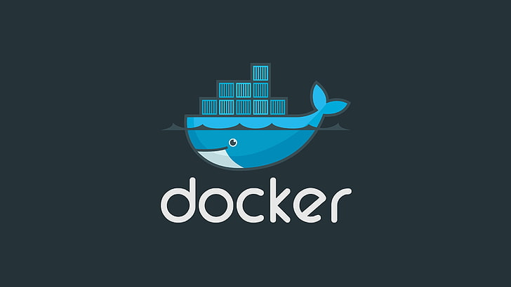

# Docker

Index

## Index

- Introduction
- Setup
- Containerization
- Create Docker Process
- Basics
- Docker Commands
- Docker Compose

- 

---

Introduction

## Introduction

- Docker is a containerization software.
- containerization means the process of executing application inside the container is called containerization.
- using Docker we will run our application as a container.
- Docker is used to simplify our application deployment process.
- - Containers are lightweight, isolated environments that package applications and their dependencies.
- Docker will take care of required dependencies of our application like (install java application dependencies, python application dependencies, nodejs application dependencies).

- with Docker we can execute our application in any machine.
- Docker is an open-source platform for developing, shipping, and running applications in containers.

- To avoid Environmental issues, so we are going for Docker.
- Docker will download that application dependencies to execute our code.

- we no need to bather about OS (windows / linux / mac), it run same way on every environment.

### Virtualization

- Running one operating system inside another operating system is called Virtualization.

### Documentation

[https://docs.docker.com/reference/]

---

Setup

## Setup

1. Uninstall any previous Docker installations.
2. Enable virtualization on your machine.
3. Download and install Docker from Docker Hub. - [https://hub.docker.com/]
4. Enable necessary Windows features for Docker.
5. Start the Docker

---

Containerization

## Containerization

- Packaging application code and dependencies into a single unit called a container.
- Executing application as a container is called containerization.
- Container is an Virtual machine (linux VM) -> this is separate machine
- Every container is a separate Linux System.
- Every container contains source code, libraries and dependencies.

### Process of Containerization

1. Source code
2. pom.xml -> libraries information -> mavel downloads libraries
3. Dockerfile -> Dependencies information -> what softwares are required for run our application

---

Create Docker Process

## Create Docker Process

- Dockerfile -> It contains instructions to create Docker Image.
- Docker Image -> It contains code, libraries and dependencies.
- Docker hub -> A repository to store and share Docker images.

### docker image

1. compile
2. package (jar/war)
3. build docker image

---

Basics

## Basics

- Images
- Containers
- Volumes

---

docker commands

## docker commands

- initially start the Docker then run the docker commands.

### docker images

- It is used to check all the available docker images.
- image is a package which contains (code + dependencies)
- `docker images` - to display available docker images

### docker hub

- you can call docker hub is the docker registry.
- It is used to check all the available docker images.
- you can check your own images and public images.
- docker image contains (code + dependencies)
  - `docker pull <image_name>` or `docker image pull <image_name>` - download docker image
  - Ex : `docker pull hello-world` it downloads from docker hub

### docker run

- creating docker container
- `docker run <image_name>` or `docker run <image_id>` - create container with default container name
- Ex : `docker run hello-world`
- `docker run --name my-hello-world-one <image_name>` - create container with container name
- Ex : `docker run --name my-hello-world-one hello-world`

### port mapping

- `docker run -p <host_port>:<container_port> <image_name>` - run the application
- EX : `docker run -p 8080:8080 hello-world`

### delete the docker image

- first delete container then delete the image
- `docker rm <container_name>` or `docker rm <container_id>` - delete the container
- Ex : `docker rm my-hello-world-one`
- `docker rmi <image_name>` or `docker rmi <image_id>` - delete the docker image
- Ex : `docker rmi hello-world`

### detached mode

- After creating the container my terminal should be available to execute the further commands.
- If you want to run the container in the background instead, you can use the --detach (or -d ) flag. This starts the container without occupying your terminal.
- we can use terminal for other commands.
- `docker run -d -p 8080:8080 <image_name>` - run the application in detached mode
- Ex : `docker run --name my-hello-world-one -d -p 8081:8081 hello-world`

### display containers

- `docker ps` - to display all the running containers
- `docker ps -a` - to display running and stopped containers

### stop the container

- `docker stop <container_name>` or `docker stop <container_id>` - to stop the running container
- Ex : `docker stop my-hello-world-one`

### start the container

- `docker start <container_name>` or `docker start <container_id>` - to start the stopped container
- Ex : `docker start my-hello-world-one`

### system prune

- `docker system prune -a` - to delete un-used images + stopped containers

### docker logs

- `docker logs <container_id` - to see container logs

### docker command

- `docker run -d -p 9090:9090 --name my-container-one hello-world`

* -d represents detached mode
* -p represents port mapping
* --name represents name of the container

---

Docker Compose

## Docker Compose

- Write Docker Compose file - use yaml
- Run Docker Compose file `docker-compose -f fileName.yaml up`

---
