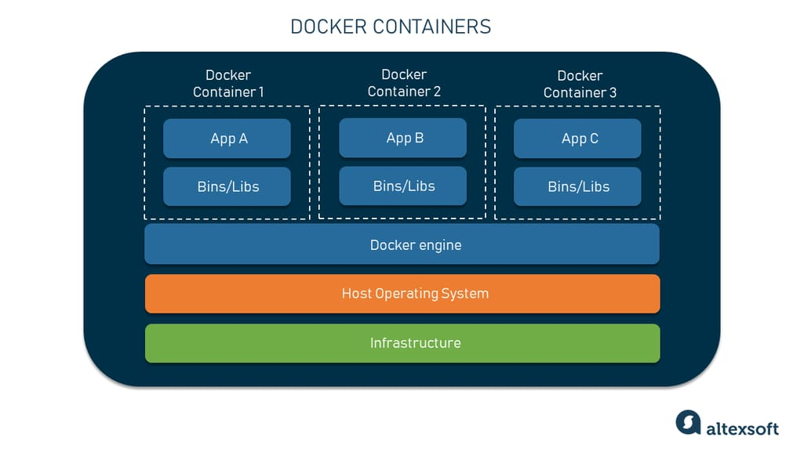

# Docker

Docker

## Index

- Introduction
- Terminology
- Docker Installation
- Documentation

---

Introduction

## Introduction

- Docker is a tool that puts your app and its dependencies into a box called a container. This container works the same on any computer.

- Docker is a containerization software.
- containerization means the process of executing application inside the container is called containerization.
- With Docker we can execute our application in any machine,
  we no need to bather about OS (windows / linux / mac) or any dependency versions, it run same way on every environment.

### without Docker

- You build the app on your computer.
- It works fine for you.
- But it doesn’t work on other computers.
- Why? Because other computers might not have the same tools — like the right operating system, libraries, software versions, ...etc that your app needs.

### with Docker

- You build the app and pack everything it needs into a container.
- That container runs the same way everywhere.
- No more "It works on my machine" issues.

---

Terminology

## Terminology

1. Virtualization

### 1. Virtualization

Running one operating system inside another operating system is called Virtualization.

### 2. Containerization

- A container is a box that holds your app and everything it needs.
- Containerization means running your app inside that box.
- Each container is like its own small computer (using Linux).
- This way, your app works the same on any computer.
  

---

Docker Installation

## Docker Installation

1. Uninstall any previous Docker installation.
2. Enable virtualization on your machine.
   
3. Download and install Docker from Docker Hub. - [https://hub.docker.com/]
   
4. Check Docker Version
   
5. Enable necessary Windows features for Docker.
   
6. Start the Docker
   

---

Documentation

## Documentation

- Official Docker Documentation: [https://docs.docker.com/reference/]

