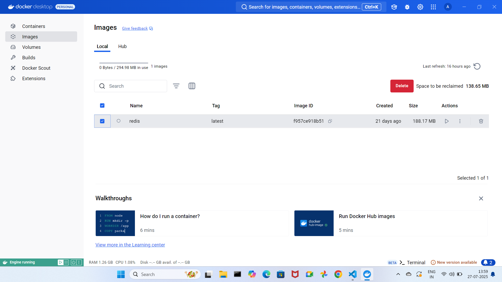
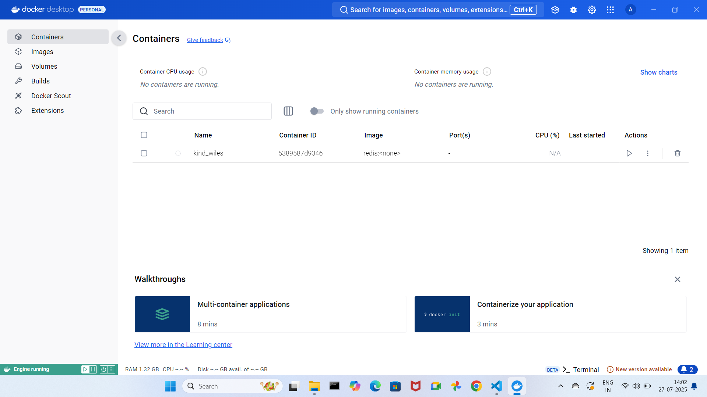
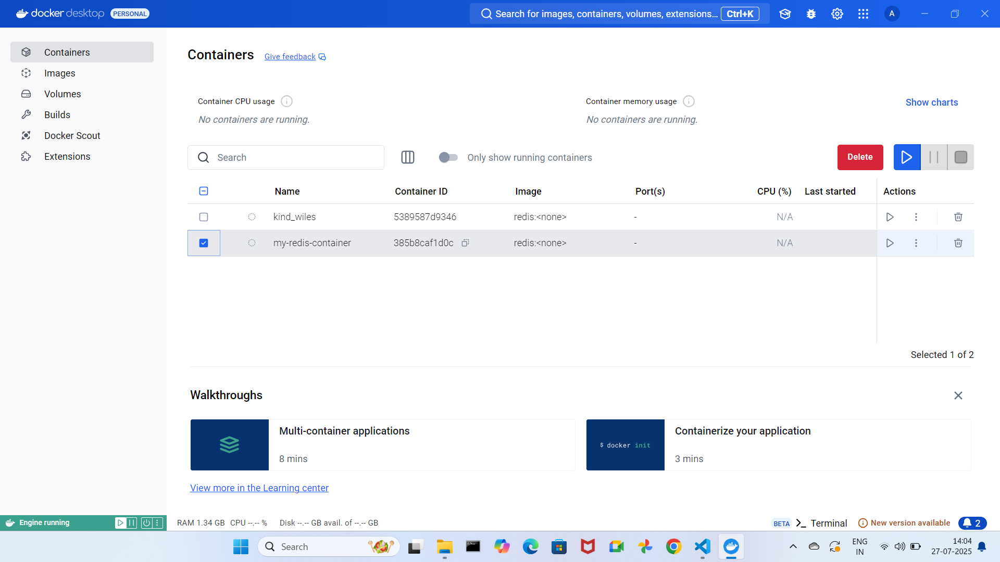
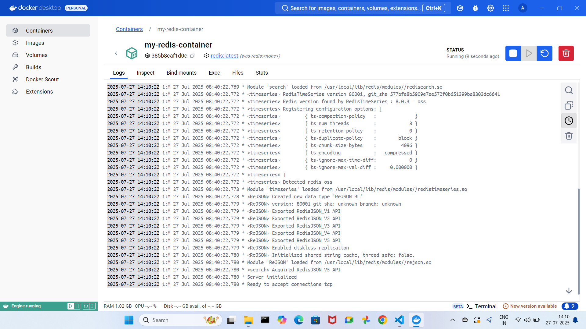

# Docker Commands

### Pre-requisites

- Initially start the Docker then run the docker commands.

1. check available docker images in Local
2. download docker image from Docker-Hub
3. create container
4. start container
5. stop container
6. delete container
7. delete docker image

### 01 Check available docker images in Local

- command: `docker images`

### 02. download docker image from Docker-Hub

- command: `docker pull <image_name>`
- It is used to download docker image from docker-hub (docker registry).
- In the docker-hub, you can check your own images and public images.
- Ex : `docker pull redis`
- 

### 03. create container

- command: `docker create <image_id>` or `docker create <image_name>`
- It is used to create docker container with random name
- Ex : `docker create redis`
- 

- command: `docker create --name <custom_container_name> <image_id>`
- It is used to create docker container with given container name
- Ex : `docker create --name my-redis-container redis`
- 

### 04. Check available docker containers

- command : `docker ps` - Shows only running containers
- command : `docker ps -a` - Shows all containers (running + stopped)

### 05. start the container

- command: `docker start <container_name>` or `docker start <container_id>`
- It is used to start the docker container.
- Ex : `docker start my-redis-container`
- 

### 06. Create & Start the Container

- command: `docker run --name <container_name> <image_id>`
- It is used to create and start the docker container with given container name.

### 07. Detached Mode

- command: `docker run -d --name <container_name> <image_id>`
- It is used to create and start the docker container in detached mode.
- Ex : `docker run -d --name my-redis-container redis`
- - The `-d` flag runs the container in the background so you can use your terminal for other commands.

### 08. Conatiner Logs

- command : `docker logs <container_name>`
- It is used to see container logs

### 09. Stop the Container

- command: `docker stop <container_name>` or `docker stop <container_id>`
- It is used to stop the running container.
- Ex : `docker stop my-redis-container`

### 10. Delete the Container

- command: `docker rm <container_name>` or `docker rm <container_id>`
- It is used to delete the container.
- Ex : `docker rm my-redis-container`

### 11. Delete all stopped containers

- command: `docker container prune`
- It is used to delete all stopped containers.

### 12. Delete the Docker Image

- First delete the container then delete the image.
- command: `docker rmi <image_name>` or `docker rmi <image_id>`
- It is used to delete the docker image.
- Ex : `docker rmi redis`

### 13. Port mapping

- Connects container ports to your computer ports.
- Access apps inside containers from your computer.
- Makes applications inside containers accessible from your host machine.
- command: `docker run -p <host_port>:<container_port> <image_id>`
- Ex : `docker run -p 8080:8080 redis`
- `8080:8080` = "connect my computer port 8080 to container port 80"
- You can open it in browser at `localhost:8080`.
- 

### Example Docker Command

- command : `docker run -d -p 8080:8080 --name my-redis-container redis`

* `-d` represents detached mode
* `-p` represents port mapping
* `--name` represents name of the container

## Docker Debugging

- `docker ps` - show running containers
- `docker exec -it <container_name_or_id> /bin/bash`
