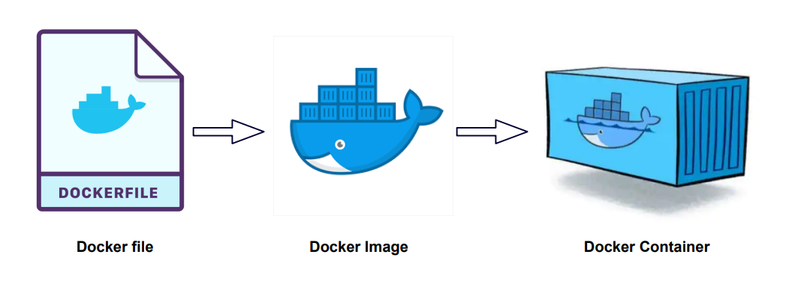
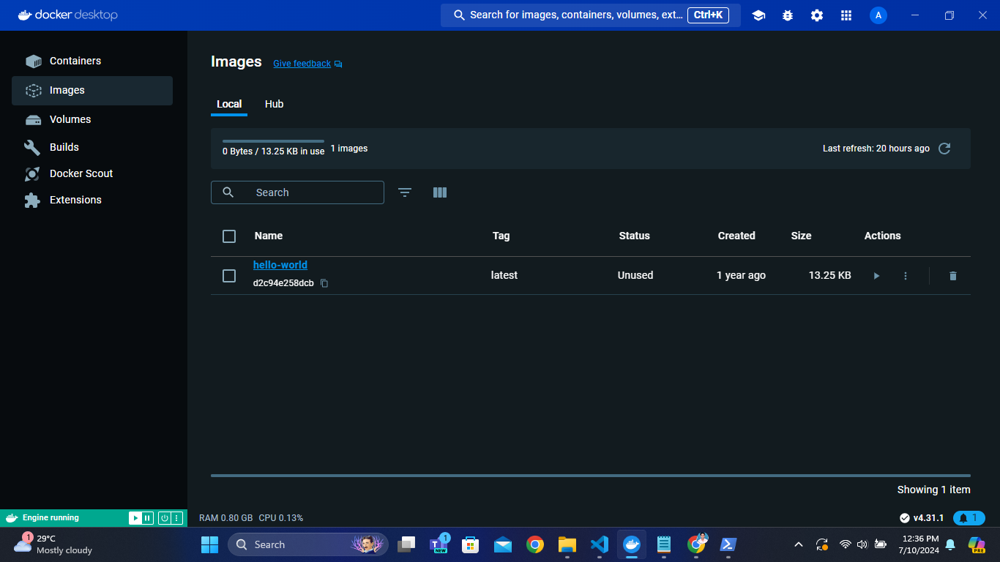
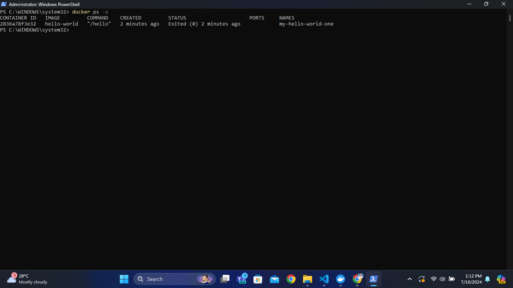
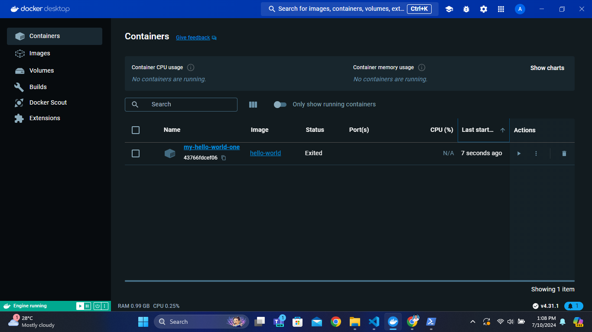
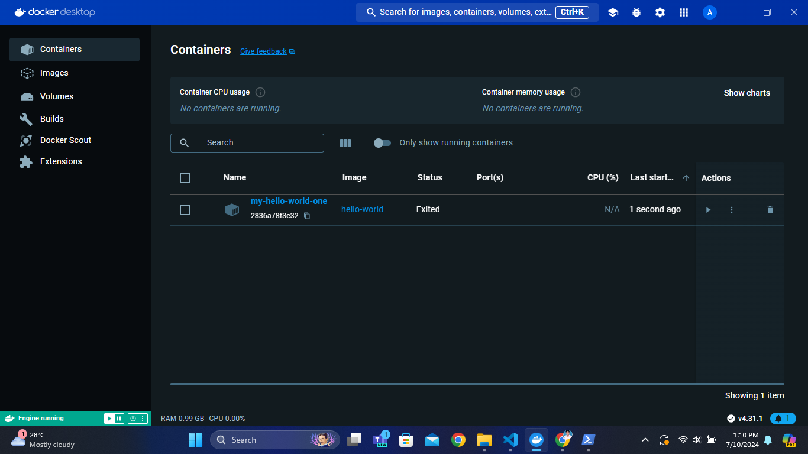
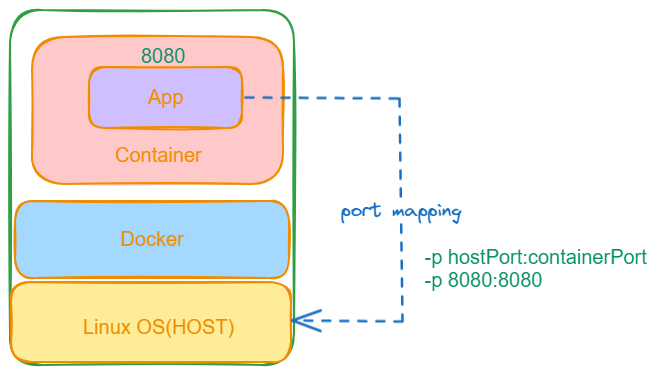
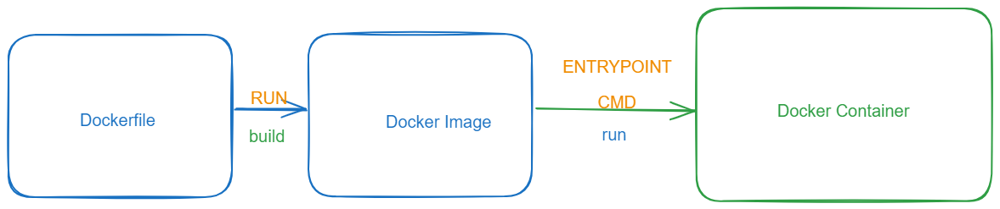

# Docker

<details>
<summary>Index</summary>

## Index

- Introduction
- Setup
- Docker Build Process
- Docker Commands
- Dockerfile
- yaml
- Docker Compose

</details>

---

<details>
<summary>Introduction</summary>

## Introduction

- Docker is an open-source platform for developing, shipping, and running applications in containers.
  - developing -> writing Dockerfile & build Docker image
  - shipping -> store Docker Image that can use others
  - Running -> Run the Docker Image in container

</details>

---

<details>
<summary>Docker Build Process</summary>

## Docker Build Process

1. Dockerfile -> It contains instructions to create Docker Image.
2. Docker Image -> It contains code, libraries and dependencies.
3. Docker hub -> A repository to store and share Docker images.

### Basics

- Images: Blueprints for creating containers.
- Containers: Running instances of images.
- Volumes: Storage areas for saving data used by containers.



</details>

---

<details>
<summary>Docker Commands</summary>

## Docker Commands

Initially start the Docker then run the docker commands.

### 1. Check available docker images in Local

- `docker images`
- It is used to check all the available docker images.
- image is a package which contains (code + dependencies)

### 2. download docker image from Docker-Hub

- `docker pull <image_name>` or `docker image pull <image_name>`
- It is used to download docker image from docker-hub (docker registry).
- In the docker-hub, you can check your own images and public images.
  - Ex : `docker pull hello-world`
  - 

### create container

- `docker create <image_name>` or `docker create <image_id>`
- It is used to create docker container with random name
- Ex : `docker create hello-world`

- `docker create --name <container_name> <image_name>`
- It is used to create docker container with given container name
- Ex : `docker create --name my-hello-world-one hello-world`
- 

### display containers

- `docker ps` - to display all the running containers
- `docker ps -a` - to display running and stopped containers
- 

### start the container

- `docker start <container_name>` or `docker start <container_id>` - It is used to start the docker container.
- Ex : `docker start my-hello-world-one`
- 

### Create & run the Container

- `run` is used to create and run the container at a time.
- `docker run <image_name>` or `docker run <image_id>`
- It is used to create docker container with random name
- Ex : `docker run hello-world`

- `docker run --name <container_name> <image_name>`
- It is used to create docker container with given container name
- Ex : `docker run --name my-hello-world-one hello-world`
- 

### Run the Container in detached mode

- After creating the container my terminal should be available to execute the further commands (container without occupying your terminal), you can use the --detach (or -d ) flag.
- `docker run -d <image_name>`
- It is used to run application in detached mode.
- Ex : `docker run --name my-hello-world-one -d hello-world`

### container logs

- `docker logs <container_name>`
- It is used to see container logs

### stop the container

- `docker stop <container_name>` or `docker stop <container_id>`
- It is used to stop the running container.
- Ex : `docker stop my-hello-world-one`

### delete the container

- `docker rm <container_name>` or `docker rm <container_id>`
- It is used to delete the container
- Ex : `docker rm my-hello-world-one`

### delete the docker image

- first delete container then delete the image
- `docker rmi <image_name>` or `docker rmi <image_id>`
- It is used to delete the docker image
- Ex : `docker rmi hello-world`

### delete stopped containers and un-used images

- `docker system prune -a`
- It is used to delete un-used images + stopped containers

### port mapping

- Makes applications inside containers accessible from your host machine.
- `docker run -p <host_port>:<container_port> <image_name>`
- EX : `docker run -p 8080:8080 hello-world`
- 

### docker command

- `docker run -d -p 9090:9090 --name my-container-one hello-world`

* `-d` represents detached mode
* `-p` represents port mapping
* `--name` represents name of the container

</details>

---

<details>
<summary>Dockerfile</summary>

## Dockerfile

- 
- 

- we write some instructions to build Docker image.
- Dockerfile is used to specify dependencies are required for the application.

* **Dockerfile -> Docker Image -> Docker Registry**

### Steps :

1. Dockerfile
2. Docker Image
3. Docker Registry
4. Docker Container

---

### Dockerfile

- It contains instructions to build image.
- we will specify application dependencies here.
- Dockerfile keywords
  - FROM
  - MAINTAINER
  - COPY
  - RUN
  - CMD
  - EXPOSE
  - WORKDIR
  - ENTRYPOINT

### Dockerfile keywords

- FROM : Every dockerfile starts with `FROM` keyword.
  It is used to specify base image required for our application. The software (dependency) is required to run our code.
  Ex : `FROM : node` , `FROM : mysql`, `FROM : python`

- MAINTAINER : It is used to specify author of Dockerfile.
  EX : `MAINTAINER <andepraveen>`

- COPY : It is used to copy the files from host machine to container machine.
  EX : `COPY <src> <des>`
  EX : `COPY target/app.war /user/app/node/webapp.war`

- RUN : It is used to execute instructions while creating docker image.
  EX :`RUN git clone <url>`
  EX :`RUN git clone <url>`

  Note : We can run write multiple RUN instructions in Dockerfile and they will be processed from top to bottom.

- CMD : It is used to execute instructions while creating docker container. Here overriding possible.
  EX : `CMD npm install`

- Note : If we write multiple CMD instructions docker will process only last CMD instruction.

- ENTRYPOINT : - CMD : It is used to execute instructions while creating docker container. Here, overriding not possible.
  EX : `ENTRYPOINT npm install`

- EXPOSE : It is used to specify container port number. It is just readability and documentation purpose.
  EX : `EXPOSE 8080`

- WORKDIR : It is used to specify working directory (path change).
  Ex : `WORKDIR /user/app`

### 1. Dockerfile

- Docker file is used to build an image

* Naming Convention : Dockerfile
* Write Dockerfile

```dockerfile

# sample Dockerfile
FROM node:22-alpine3.19
MAINTAINER <andepraveen>
RUN 'echo run msg - 1'
RUN 'echo run msg - 2'
CMD 'echo cmd msg - 1'
CMD 'echo cmd msg - 2'
```

### 2. Docker Image

- `docker build -t <image_name> . ` -> dot is the current working directory
- Ex : `docker build -t app1 .` - **-t** means tagName
- `docker build -t <image_name> -f <file_name>` - if docker file name is other than Dockerfile
- Ex : `docker build -t app2 -f praveenDockerfile`

### 3. Docker Container

- Run the Container
- `docker run app1`

### 4. Docker Registry

- Create Docker Image - `docker build -t andepraveen/app1 .`
- `docker login` - Login into Your Docker hub Account
- `docker push andepraveen/app1` - it store in the Docker hub
- use tagnames
  - `andepraveen/app:v1`
  - `andepraveen/app:0.0.1`
  - `andepraveen/app:latest`

### Run Docker Application

1. `git clone <repo>`
2. `cd <dir_name>`
3. `docker build -t <docker_image>`
4. `docker images` - check docker image
5. `docker run -d -p 5000:5000 <docker_image>`

</details>

---

<details>
<summary>yaml</summary>

## yaml

- **yaml** stands for **Ain't Markup Language**
- YAML is a human-readable data serialization language that is often used for writing configuration files.
- YAML is a superset of JSON, which means that any valid JSON document is also a valid

### yaml docs

https://docs.ansible.com/ansible/latest/playbook_guide/playbooks.html#working-with-playbooks

### Write yaml file

- fileName.yaml
- yaml uses Indentation
- with indentation we can create object (`key:value`)

</details>

---

<details>
<summary>Docker Compose</summary>

## Docker Compose

- It is used to manage multi container based applications.
- when we are working with microservices based app we will have multiple services. Every service will have its own docker image.
- To work with docker compose we need to create docker-compose.yaml file.

### write docker-compose

- Write Docker Compose file - use yaml
- Run Docker Compose file `docker-compose -f fileName.yaml up`

### Without Docker Compose

- every thing you need to do manually, lot of time consuming.
- we create and run all containers individually.

```Dockerfile
docker run -d -p 8080:8080 --name hotels <image_name>
docker run -d -p 8080:8080 --name flights <image_name>
docker run -d -p 8080:8080 --name trains <image_name>
docker run -d -p 8080:8080 --name cabs <image_name>
```

### Docker Compose

- Docker Compose is used to manage multiple docker containers.

- we can start the multiple containers at a time.
- we can stop the multiple containers at a time.

* `docker-compose up` - it creates multiple containers at a time
* `docker-compose down` - it delete multiple containers at a time

- when we are working with microservices based app we will have multiple services. Every service will have its own docker image.

### create docker-compose

- src -> source code of the project
- pom -> libraries information
- Dockerfile -> Dependencies
- docker-compose -> containers information

* `docker-compose build` These are created the images
* `docker-compose up` It will read docker-compose yaml then it creates containers according to 'docker-compose.yaml'
* `docker-compose up -d` creates containers in the detached mode
* `docker-compose down` stops and removes all containers defined in your docker-compose.yml.

* `docker-compose down && docker-compose build && docker-compose up -d` - run all the commands

### steps to write docker-compose file

1. version
2. services
   1. service_name
      1. depends_on
      2. environment
      3. build
      4. restart
      5. container_name
      6. ports
      7. healthCheck
      8. network
      9. volumes
3. networks
   1. commonNetwork
      - `driver: bridge`
4. volumes
   - db_database

```py
version: "3.8"

services:

  # 01 Database Server
  db: # Defines the 'db' service for MySQL database
    image: mysql:8.0 # Uses the MySQL 8.0 Docker image
    container_name: db
    environment: # Sets environment variables for the database configuration
      - MYSQL_USER=database # username
      - MYSQL_PASSWORD=pass123 # Sets the password for the MySQL user
      - MYSQL_DATABASE=appdb # Specifies the name of the database
      - MYSQL_ROOT_PASSWORD=pass123 # Sets the root password for MySQL
    ports:
      - 3307:3306 # Maps the container's port 3306 to the host's port 3307
    networks:
      - sameNetworkAsMysql # Connects the service to the 'sameNetworkAsMysql' network
    volumes:
      - db_data:/var/lib/mysql

  # 02 Backend Server
  api: # Defines the 'api' service for the backend API
    depends_on:
      - db # Specifies that the 'api' service depends on the 'db' service
    environment:
      - DB_HOST=db
      - DB_USER=database
      - DB_PASSWORD=pass123
      - DB_NAME=appdb
      - DB_PORT=3306
    build: # Builds the backend API using the provided Dockerfile
      context: ./backend # Specifies the build context directory for the backend
      dockerfile: Dockerfile # Specifies the Dockerfile to use for building the backend
    restart: on-failure # Restarts the container if it fails
    container_name: api
    ports:
      - 5000:5000 # Maps the container's port 3000 to the host's port 3000
    healthcheck:
      test: ["CMD", "curl", "-f", "http://localhost:5000/"]  # Adjust your backend health endpoint
      interval: 10s
      retries: 5
    networks:
      - sameNetworkAsMysql # Connects the service to the 'sameNetworkAsMysql' network

  # 03 Frontend Server
  frontend: # Defines the 'frontend' service for the frontend app
    depends_on:
      api: # Specifies that the 'frontend' service depends on the 'api' service
        condition: service_healthy  # Wait until the backend service is healthy
    build: # Builds the frontend app using the provided Dockerfile
      context: ./frontend # Specifies the build context directory for the frontend
    restart: on-failure # Restarts the container if it fails
    container_name: frontend
    ports:
      - 3000:3000 # Maps the container's port 3000 to the host's port 3001
    networks:
      - sameNetworkAsMysql # Connects the service to the 'sameNetworkAsMysql' network

networks:
  sameNetworkAsMysql: # Defines the 'sameNetworkAsMysql' network
    driver: bridge # Specifies the network driver as 'bridge'

volumes:
  db_data:

```

### Execute the docker-compose file

1. kill the running ports that are using in docker-compose
2. docker-compose up --build
</details>

---

<details>
<summary>Docker Debugging</summary>

## Docker Debugging

### Open docker Container shell

- `docker ps` - show running containers
- `docker exec -it <container_name_or_id> /bin/bash`
</details>

---
